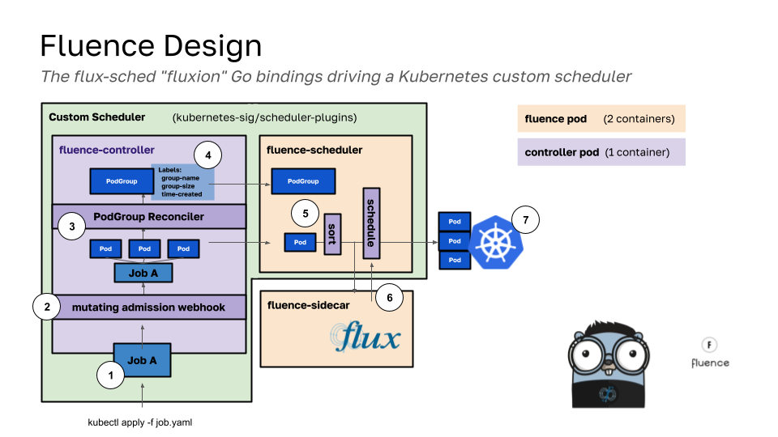

# Development Notes

## Design

The picture above shows the fluence custom scheduler, which uses the Flux Framework component "fluxion" Go bindings in a custom Kubernetes scheduler. In the above, we see two pods running in a Kubernetes cluster that are intended for scheduling. The fluence pod (beige) has the fluence-sidecar and the fluence-scheduler, 2 containers. The controller pod has the fluence controller (1 container). Generally speaking, the containers are responsible for the following:

- **fluence-controller**: watches for incoming pods and abstractions with pods (e.g., job) to create corresponding pod groups with names, sizes, and timestamps
- **fluence-scheduler**: provides the expected scheduling plugin with functions to sort, pre-filter, etc. the queue of pods is essentially moving through here
- **fluence-sidecar**: the fluxion GRPC service that is queried by the fluence-scheduler to request an allocation for a pod group

Both the controller and scheduler logic are bootstrapped from the same underlying kubernetes-sigs project, the scheduler-plugins, despite being in different pods (green). For steps, scheduling works as follows. Note that it is [much more complicated than this](https://kubernetes.io/docs/concepts/scheduling-eviction/scheduling-framework/), but we explain the high level details.

1. A user submits a job to their cluster with kubectl after installing fluence with helm charts.
2. The mutating webhook provided by the fluence-controller intercepts the job and adds labels
3. The controller for PodGroup (an abstraction that holds a name, size, and time created to describe one or more pods) is watching for pod events
4. When a pod is creating (it shows up as Pending or other in the cluster, and doesn't have to be scheduled yet) it starts to reconcile
  - The reconcile ensures that the PodGroup is created and updated with the correct metadata and statuses (and cleaned up when the time comes)
5. As soon as the Pod is pending and the group exists, it starts going through the scheduling [queue and process](https://kubernetes.io/docs/concepts/scheduling-eviction/scheduling-framework/) and hits the fluence-scheduler endpoints
  - The fluence-scheduler uses the PodGroup name to associate each individual pod with a group and start time, allowing to sort them together
  - Starting times are based on micro seconds to provide a distinct-ness to group creation times, even when done en-masse
  - Pods that don't get have a group (if there is delay in the reconciler making one) are pushed off from scheduling until they do.
6. Fluxion is queried via a GRPC endpoint, asking for a match for the job specification and an allocation -- "MatchAllocate"
7. The pods are then scheduled together, and the abstraction (e.g., Job) created in the Kubernetes cluster
  - When the top level abstraction cleans up and the PodGroup size is equal to the number of pods finished or failed, the PodGroup cleans up

The result is (hopefully) a smooth and efficient scheduling experience. We are still working on it.

## Thinking

> Updated February 15, 2024

What I think might be happening (and not always, sometimes)

- New pod group, no node list
- Fluence assigns nodes
- Nodes get assigned to pods 1:1
- POD group is deleted
- Some pod is sent back to queue (kubelet rejects, etc)
- POD group does not exist and is recreated, no node list
- Fluence asks again, but still has the first job. Not enough resources, asks forever.

The above would not happen with the persistent pod group (if it wasn't cleaned up until the deletion of the job) and wouldn't happen if there are just enough resources to account for the overlap.

- Does Fluence allocate resources for itself?
- It would be nice to be able to inspect the state of Fluence.
- At some point we want to be using the TBA fluxion-go instead of the one off branch we currently have (but we don't need to be blocked for that)
- We should (I think) restore pod group (it's in the controller here) and have our own container built. That way we have total control over the custom resource, and we don't risk it going away.
  - As a part of that, we can add add a mutating webhook that emulates what we are doing in fluence now to find the label, but instead we will create the CRD to hold state instead of trying to hold in the operator.
- It could then also be investigated that we can more flexibly change the size of the group, within some min/max size (also determined by labels?) to help with scheduling.
- Note that kueue has added a Pod Group object, so probably addresses the static case here.
